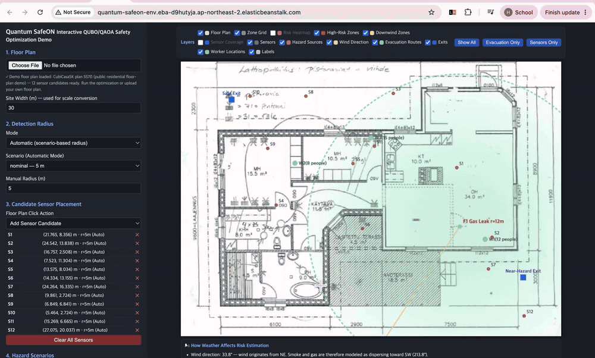
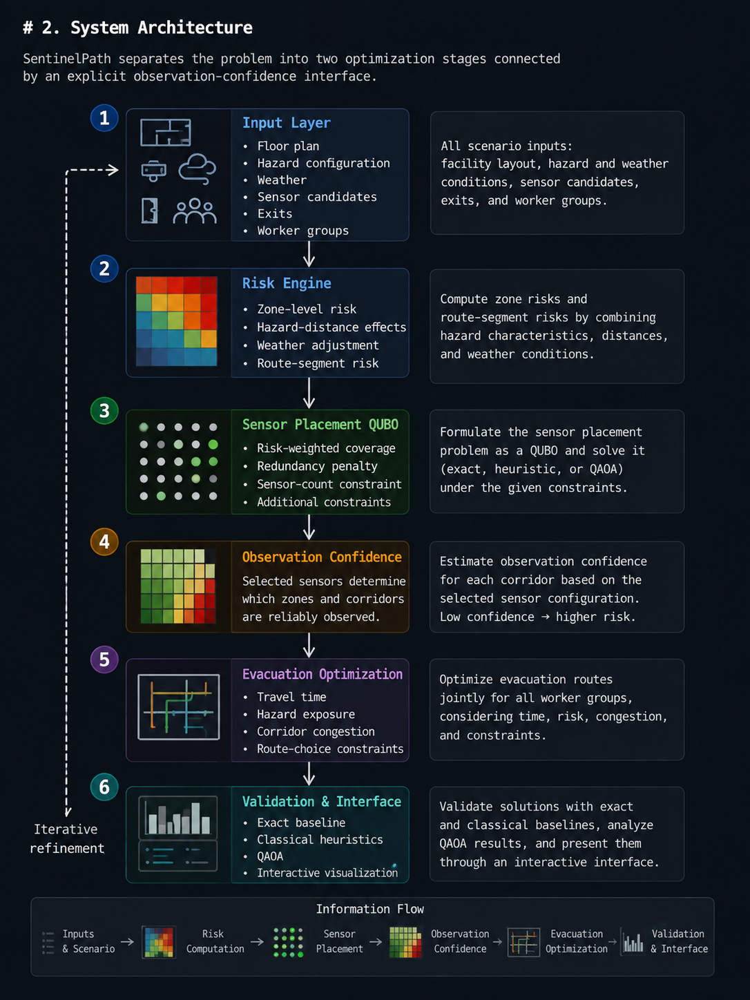

# SentinelPath

### Risk-Aware Sensor Placement & Evacuation via Sequentially Coupled QUBOs

**Exact Classical Validation · QAOA State Analysis · Interactive AWS Deployment**

SentinelPath is a research and software prototype for **hazard-aware sensor placement and evacuation planning** under changing site conditions.

The system sequentially connects **sensor-placement optimization**, **observation confidence**, and **congestion-aware evacuation planning**, while using exact classical optimization as a reference baseline and QAOA as an additional combinatorial optimization framework.

> **Core idea:** Optimize what the system can reliably observe, then optimize how people should evacuate under that level of observation confidence.

---

## Interactive AWS Demo

**Live Demo:** [Launch the AWS-deployed application](http://quantum-safeon-env.eba-d9hutyja.ap-northeast-2.elasticbeanstalk.com/)

<p align="center">
  
</p>

**Demo workflow**

`Floor Plan → Hazard & Weather → Risk Modeling → Sensor QUBO → Observation Confidence → Evacuation Analysis → QAOA State Interpretation`

> The public demo uses a **CubiCasa5K residential floor plan** as a visualization example.  
> It is not presented as a real semiconductor, construction, or industrial-site floor plan.

---

## Key Results

| Experiment | Result |
|---|---|
| Sensor candidates | 12 |
| Sensor budget | `K = 6` |
| Exact sensor state space | `2^12 = 4,096` |
| Feasible six-sensor combinations | `C(12,6) = 924` |
| Weather sensitivity | Optimal placement retained in `30 / 32` synthetic scenarios |
| Evacuation crossover | Independent shortest paths stopped being globally optimal at 320 workers in the tested synthetic network |
| 320-worker makespan | `384.2 s → 312.9 s` |
| Makespan improvement | `71.3 s` / `18.6%` |
| Quantum validation | Ideal-statevector QAOA + exact classical reference |
| Physical QPU | Not executed / not claimed |
| Cloud deployment | AWS Elastic Beanstalk |

> **This project does not claim quantum advantage.**  
> At the current problem size, exact classical optimization remains computationally feasible and is used as the reference baseline.

---
# My Role & Contributions

Quantum SafeON originated as a collaborative team project for the **Quantum Reframing Challenge 2026**, where I contributed across problem formulation, optimization design, scenario modeling, experimental interpretation, and end-to-end system reasoning.

## Collaborative Research & Optimization Design

Within the original team project, I contributed to:

- framing sensor placement and evacuation planning as interconnected combinatorial optimization problems
- translating safety requirements into QUBO objectives, penalties, and hard constraints
- designing the QUBO/QAOA methodology and experimental workflow
- modeling hazard, weather, sensor coverage, and evacuation scenarios
- analyzing exact, heuristic, and QAOA optimization results
- designing the sequential coupling between sensor observability and evacuation risk
- documenting and presenting the end-to-end optimization architecture

## Independent Engineering & System Development

After the competition, I independently transformed the research prototype into a **deployable, interpretable software system** suitable for technical demonstration and portfolio evaluation.

This work included:

- redesigning the prototype into an interactive end-to-end workflow connecting hazard inputs, optimization, validation, and visualization
- implementing extraction, ranking, and interpretation of **QAOA computational-basis states**
- building the interactive **QAOA State Distribution** interface
- translating QAOA bitstrings into physical sensor selections on the floor plan
- implementing hover-based **state-to-sensor visualization** to connect quantum outputs with real optimization decisions
- adding exact-optimum comparison logic to distinguish the selected QAOA solution from other high-probability states
- restructuring the UI to expose assumptions, constraints, failure cases, and optimization results more clearly
- refactoring the application into an English-language technical demo
- improving reproducibility and deployment configuration for the Python application
- configuring and deploying the live application on **AWS Elastic Beanstalk**, including application process configuration, environment variables, nginx port routing, IAM role separation, and EC2-backed runtime settings
- producing the interactive AWS demo and technical documentation that distinguish implemented features, experimental assumptions, and future work

> The post-competition work was not a separate reimplementation of the original team project. It was an independent engineering phase that converted the collaborative research prototype into a more interpretable, reproducible, and publicly deployable system.

---
# 1. Problem

Emergency planning is not a static shortest-path problem.

In a changing work site, factors such as:

- hazard location
- temporary structures
- worker distribution
- sensor availability
- exit availability
- wind direction and speed
- smoke or gas dispersion
- corridor congestion

can all change the safest decision.

At the same time, emergency routing depends on the quality of the information available to the system.

This creates two connected optimization questions:

1. **Where should a limited number of sensors be installed?**
2. **Which evacuation routes should be selected under the resulting risk and observation conditions?**

The objective is therefore not to install as many sensors as possible.

It is to allocate a limited sensor budget so that **high-risk areas are observed effectively**, and then incorporate that observation confidence into evacuation planning.

---

# 2. System Architecture

SentinelPath separates the problem into two optimization stages connected by an explicit **observation-confidence interface**.

<p align="center">
  
</p>

The architecture follows a sequential information flow:

**Sensor Placement → Observation Confidence → Conservative Route-Risk Adjustment → Evacuation Optimization**


---

# 3. Why Two QUBOs Instead of One?

A key design decision was **not to combine sensor placement and evacuation into one monolithic QUBO**.

Instead:

```text
Sensor QUBO
    ↓
selected sensor configuration x*
    ↓
observation confidence
    ↓
conservative route-risk adjustment
    ↓
Evacuation Optimization
```

This preserves an explicit causal interface between the two stages.

## Why not fully merge them?

A fully integrated formulation would:

- increase the number of binary variables
- introduce many additional pairwise interactions
- make the optimization harder to debug
- make it harder to explain why a sensor decision changed a route
- reduce modular verification

For 24 binary variables, a fully connected formulation can contain up to:

```text
C(24,2) = 276
```

pairwise couplings.

The sequential architecture instead keeps the relationship interpretable:

> **Sensor placement determines observation confidence; observation confidence modifies route risk; route risk changes evacuation decisions.**

---

# 4. End-to-End Synthetic Case Study: Gas Leak

A synthetic gas-leak scenario was used to trace one event through the complete pipeline.

## Step 1 — Configure the hazard

Representative scenario inputs included:

```text
Hazard: Gas Leak
Wind direction: 33.8°
Wind speed: 3.8 m/s
Modeled impact radius: 12 m
```

The `12 m` impact radius is a **demonstration assumption**, not a universal or legally defined safety distance.

---

## Step 2 — Recompute zone risk

The risk layer assigns zone-level scores using scenario configuration, location, and weather-related adjustments.

Example values from the synthetic experiment included:

```text
Z04 = 1.00
Z05 = 0.86
Z09 = 0.50
Z06 = 0.10
```

The system is **not presented as an AI model that predicts industrial accidents**.

The risk engine produces structured optimization inputs from configured assumptions and scenario data.

---

## Step 3 — Re-optimize sensor placement

With 12 candidate sensor locations and a sensor budget of `K=6`:

```math
\binom{12}{6}=924
```

feasible six-sensor combinations exist.

In the reported synthetic leak case:

```text
Before leak
C03 C04 C05 C08 C09 C10

After leak
C01 C04 C05 C08 C09 C10
```

The placement changed:

```text
C03 → C01
```

while satisfying the configured hard constraints.

Reported synthetic risk-weighted coverage:

```text
0.539
```

Reported hard-constraint violations:

```text
0
```

The significance is not the particular sensor ID.

The important behavior is that **changing the modeled risk landscape changed the optimal sensor allocation**.

---

## Step 4 — Convert coverage into observation confidence

Sensor placement affects how confidently the system can observe different corridors.

Poorly observed corridors receive a conservative risk adjustment.

Conceptually:

```math
w'_e
=
w_e
\left(
1+\alpha(1-\mathrm{conf}_e)
\right)
```

where:

- `w_e` = original modeled corridor risk
- `conf_e` = observation confidence for corridor `e`
- `α` = conservative amplification factor

This creates the explicit coupling between sensor placement and evacuation.

---

## Step 5 — Optimize evacuation jointly

For four worker groups and three candidate routes per group:

```text
3^4 = 81
```

possible joint route combinations exist.

When occupancy is small, independently selecting each group's shortest route can still produce the globally optimal solution.

As occupancy rises, however, shared corridors create interactions between groups.

---

## Step 6 — Observe the congestion crossover

At 320 total workers in the tested synthetic network:

```text
Independent shortest routes:
384.2 s

Joint optimization:
312.9 s
```

Difference:

```text
71.3 s
18.6%
```

> **The improvement comes from modeling interactions between worker groups—not from faster hardware.**

The 320-worker value is a crossover point in this **synthetic experimental network**, not a real-world safety threshold.

---

# 5. Sensor Placement QUBO

For each candidate sensor location `i`, define:

```math
x_i \in \{0,1\}
```

where:

- `x_i = 1` → install the sensor
- `x_i = 0` → do not install the sensor

A complete sensor configuration is:

```math
x=(x_1,x_2,\ldots,x_N)
```

For example:

```text
110100101010
```

represents one binary configuration over 12 candidates.

---

## 5.1 Sensor-Budget Constraint

If exactly `K` sensors must be installed:

```math
H_K
=
\lambda_K
\left(
\sum_i x_i-K
\right)^2
```

The penalty reaches its minimum when exactly `K` candidates are selected.

---

## 5.2 Risk-Weighted Coverage

Let:

- `r_z` = modeled risk weight of zone `z`
- `a_zi ∈ [0,1]` = fractional coverage of zone `z` by sensor `i`

A quadratic coverage surrogate can be written as:

```math
H_{\mathrm{coverage}}
=
-\sum_z r_z \sum_i a_{zi}x_i
+
\sum_z r_z
\sum_{i \lt j}
a_{zi}a_{zj}x_ix_j
```

The first term rewards sensor placements that observe high-risk zones.

The second term discourages redundant placement when multiple sensors strongly overlap in the same risk-weighted region.

---

## 5.3 Installation Cost

The fuller experimental formulation includes normalized installation cost:

```math
H_{\mathrm{cost}}
=
w_{\mathrm{cost}}
\sum_i
\frac{c_i}{c_{\max}}x_i
```

with experimental default:

```math
w_{\mathrm{cost}}=0.35
```

---

## 5.4 Required-Zone Coverage

Required zones can receive additional penalties.

For a zone covered by one valid sensor candidate:

```math
H_z
=
\lambda_H(1-x_i)
```

For two valid candidates:

```math
H_z
=
\lambda_H(1-x_i)(1-x_j)
```

With three or more candidates, the exact product introduces higher-order terms.

Because the solver pipeline expects a QUBO, the experimental implementation uses a **quadratic truncation** and records the approximation explicitly.

---

## 5.5 Full Experimental Sensor Objective

Conceptually:

```math
H_{\mathrm{sensor}}
=
H_{\mathrm{coverage}}
+
H_{\mathrm{cost}}
+
H_K
+
H_{\mathrm{required}}
```

The 12-variable competition-scale sensor QUBO is dense, with up to:

```text
66 / 66
```

pairwise interactions.

---

# 6. Interactive Demo QUBO

The live web application intentionally uses a lighter objective to keep interactive execution fast and interpretable.

```math
H_{\mathrm{demo}}(x)
=
-\sum_z r_z \sum_i a_{zi}x_i
+
\rho
\sum_z r_z
\sum_{i \lt j}
a_{zi}a_{zj}x_ix_j
+
\lambda_K
\left(
\sum_i x_i-K
\right)^2
```

Current defaults:

```math
\rho=0.35,\qquad \lambda_K=2.0
```

The three components are:

1. **Risk-weighted coverage reward**
2. **Redundant-coverage penalty**
3. **Sensor-budget penalty**

The interactive demo deliberately omits some installation-cost and domain-specific terms used in the fuller experimental pipeline.

This is an explicit scope decision rather than an attempt to present the demo as a complete industrial optimization model.

---

# 7. QUBO Surrogate vs. Evaluation Metric

The optimization objective is quadratic, but the selected configuration is evaluated afterward using nonlinear union coverage.

For each zone:

```math
c_z(x)
=
1-
\prod_i
(1-a_{zi}x_i)
```

Overall risk-weighted coverage:

```math
C_{\mathrm{true}}(x)
=
\frac{
\sum_z r_z c_z(x)
}{
\sum_z r_z
}
```

This distinction is intentional:

> **QUBO provides a tractable quadratic optimization surrogate, while the selected solution is evaluated afterward using nonlinear union coverage.**

This avoids pretending that overlapping sensor coverage is exactly linear.

Hard constraints are also rechecked after optimization.

A low energy alone does not make an infeasible solution acceptable.

---

# 8. Evacuation Optimization

For worker group `w` and route candidate `p`:

```math
y_{wp}\in\{0,1\}
```

where:

```text
y_wp = 1
```

means worker group `w` selects route `p`.

A simplified objective is:

```math
H_{\mathrm{evac}}
=
\sum_{w,p}
y_{wp}
\left(
T_{wp}
+
\lambda_R R_{wp}
+
\lambda_D V_{wp}
\right)
+
\kappa
\sum_{(w,p)\neq(w',p')}
S_{wp,w'p'}
y_{wp}y_{w'p'}
+
\lambda_1
\sum_w
\left(
\sum_p y_{wp}-1
\right)^2
```

where:

- `T_wp` = travel-time component
- `R_wp` = modeled route risk
- `V_wp` = additional route penalty
- `S_wp,w'p'` = shared-corridor interaction
- `κ` = congestion coupling
- final term = one-route-per-group constraint

The pairwise terms represent different physical interactions in the two optimization problems:

```text
Sensor QUBO      → overlapping observations
Evacuation QUBO  → shared-corridor congestion
```

---

# 9. Sequential Coupling Through Observation Confidence

The two optimization stages are linked by an explicit interface.

```text
1. Solve sensor-placement QUBO
                ↓
2. Obtain sensor configuration x*
                ↓
3. Estimate observation confidence
                ↓
4. Increase risk on poorly observed routes
                ↓
5. Re-optimize evacuation
```

This architecture provides two important benefits.

## Interpretability

A route change can be traced back to a change in:

```text
sensor selection
→ observation confidence
→ route risk
→ evacuation decision
```

instead of being hidden inside one large Hamiltonian.

## Modular Validation

The sensor and evacuation stages can be validated independently before their coupling is evaluated.

---

# 10. Why Scaling Matters

The current problem size is intentionally small enough for exact verification.

This is useful experimentally, but it also means the project does **not** demonstrate computational quantum advantage.

## Sensor placement

Current example:

```math
\binom{12}{6}=924
```

A larger hypothetical configuration:

```math
\binom{40}{10}
=
847660528
```

## Evacuation

Current synthetic example:

```text
3^4 = 81
```

A larger example:

```text
4^10 = 1,048,576
```

Combinatorial search grows rapidly.

However:

> **Large combinatorial search spaces alone do not prove quantum advantage.**

Future scaling studies should evaluate:

- classical runtime
- QAOA convergence
- approximation quality
- circuit depth
- two-qubit gate count
- hardware noise
- total resource cost

under matched problem instances.

---

# 11. QUBO → Ising → QAOA

Binary QUBO variables can be mapped to spin variables using:

```math
x_i
=
\frac{1-z_i}{2}
```

The resulting cost Hamiltonian can be represented as:

```math
H_C
=
\sum_i h_i Z_i
+
\sum_{i \lt j} J_{ij} Z_i Z_j
```

QAOA prepares a parameterized quantum state:

```math
|\psi(\gamma,\beta)\rangle
=
\prod_{l=1}^{p}
e^{-i\beta_l H_M}
e^{-i\gamma_l H_C}
|+\rangle^{\otimes N}
```

The final state can be written as:

```math
|\psi\rangle
=
\sum_x \alpha_x |x\rangle
```

with:

```math
P(x)
=
|\alpha_x|^2
```

Linear terms primarily map to single-qubit phase operations, while pairwise interactions produce `ZZ` / `RZZ`-type interactions.

The number and topology of these pairwise couplings are important contributors to quantum circuit cost.

---

# 12. Verification Strategy

Quantum SafeON uses **exact classical optimization as the reference baseline whenever the problem size allows it**.

For 12 sensor variables:

```text
2^12 = 4,096
```

binary states can be exhaustively evaluated.

The original validation workflow included:

| Category | Method |
|---|---|
| Exact reference | Exhaustive enumeration |
| Classical heuristic | Greedy |
| Classical heuristic | Simulated Annealing |
| Classical baseline | Random |
| Ideal quantum simulation | Statevector QAOA |
| QAOA depth | `p=1`, `p=2` |
| Cloud reference | IonQ simulator workflow |

Invalid hard-constraint solutions are excluded from recommended results even if their raw energy is favorable.

---

## 12.1 Quantum Compilation Reference

For the dense 12-variable sensor QUBO, the reference compilation reported:

| Metric | Value |
|---|---:|
| Logical qubits | 12 |
| Transpiled depth | 25 |
| Pairwise `RZZ` terms | 66 |
| Added SWAP operations | 0 |

The zero-SWAP result is consistent with the all-to-all connectivity model used for the IonQ target.

These are **compilation / simulator reference metrics**.

### Physical QPU Status

**This repository does not claim execution on a physical IonQ QPU.**

Physical-QPU evaluation remains future work.

---

# 13. Experimental Results

## 13.1 Weather Sensitivity

The original experiment evaluated:

```text
8 wind directions
×
4 wind-speed levels
=
32 synthetic weather scenarios
```

Reported result:

```text
30 / 32
```

scenarios retained the same optimal sensor placement as the no-wind baseline.

The two changed configurations occurred only under the tested:

```text
10 m/s
```

strong-wind scenarios.

The configured hard coverage threshold remained satisfied across all 32 scenarios.

These are **sensitivity scenarios**, not 32 independent real-world weather observations.

---

## 13.2 Congestion Crossover

The evacuation experiment evaluated when independently selecting each worker group's shortest route stops producing the globally optimal solution.

| Total Occupancy | Independent Shortest Routes Globally Optimal? | Reported Result |
|---:|:---:|---|
| 24 | Yes | No difference |
| 60 | Yes | No difference |
| 120 | Yes | No difference |
| 200 | Yes | No difference |
| **320** | **No** | **384.2 s → 312.9 s** |
| 480 | No | 384.2 s → 369.7 s |

At 320 workers:

```text
Makespan reduction: 71.3 s
Relative reduction: 18.6%
```

The result demonstrates that:

> **individually optimal paths no longer compose into a globally optimal evacuation plan once shared-corridor congestion becomes significant.**

---

## 13.3 Classical Baselines vs. QAOA

For the 12-variable sensor-placement problem with `K=6`:

| Detection Radius | Exact Weighted Coverage | QAOA `p=1` | QAOA `p=2` |
|---|---:|---|---|
| Low | 0.197 | Optimal state found | Optimal state found |
| Nominal | 0.510 | Optimal state found | Optimal state found |
| High | 0.682 | Not found | Optimal state found |

The `p=1` failure in the high-radius case is intentionally retained rather than hidden.

For these small instances, classical methods can also reach the exact optimum in reported cases.

> **The value of this project is the explicit combinatorial reformulation, coupling architecture, and interpretable validation workflow—not a claim that QAOA outperforms classical optimization at this scale.**

---

# 14. QAOA State Distribution

One of my independent post-competition extensions was making the QAOA result **interpretable inside the application**.

Instead of displaying only a final objective value, the backend extracts the highest-probability computational-basis states from the optimized statevector.

For each state, the UI displays:

- rank
- bitstring
- probability
- selected sensors
- QUBO energy
- exact-optimum comparison

Example:

```text
Bitstring
110100101010

Selected Sensors
S1, S2, S4, S7, S9, S11
```

The interpretation flow becomes:

```text
QAOA Statevector
       ↓
Probability P(x)
       ↓
Binary State
110100101010
       ↓
Selected Sensors
S1 S2 S4 S7 S9 S11
       ↓
Interactive Floor Plan
```

When the user hovers over a QAOA state, the corresponding sensor candidates are highlighted directly on the floor plan.

This makes the relationship between:

```text
quantum-state probability
        ↕
actual optimization decision
```

visually inspectable.

---

# 15. Interactive Web Application

The current web interface supports:

- interactive floor-plan visualization
- automatic / manual detection radius
- sensor-candidate placement
- multiple hazard sources
- hazard positioning directly on the floor plan
- weather adjustment
- exits
- worker locations and occupancy
- risk heatmap
- risk-aware evacuation analysis
- congestion analysis
- exact classical sensor optimization
- ideal-statevector QAOA
- optional IonQ simulator integration
- QAOA State Distribution
- state-to-sensor highlighting
- layer filtering
- route inspection
- human-readable result explanations

The web demo does **not** execute on a physical QPU.

---

## 15.1 Recorded Demo Configuration

The AWS demo GIF uses a deliberately constructed scenario designed to make the system behavior easy to inspect.

These values are **demonstration inputs**, not calibrated industrial measurements.

| Configuration | Demo Value | Rationale |
|---|---|---|
| Sensor candidates | `S1–S12` | Keeps the 12-variable state space exactly verifiable |
| Sensor budget | `K=6` | Forces a meaningful allocation tradeoff |
| Detection radius | `5 m` nominal | Uses the nominal demo configuration |
| Hazard type | Gas Leak | Demonstrates risk and weather interaction |
| Hazard location | `(22,13) m` | Creates spatial variation across candidate sensors and exits |
| Hazard radius | `12 m` | Representative demo assumption affecting multiple regions |
| Hazard intensity | `1.0` | Fixed reference intensity |
| Wind | `33.8° NE`, `3.8 m/s` | Demonstrates directional risk adjustment |
| Exits | `(27,17)`, `(4,3)` | Creates distinct evacuation alternatives |
| Worker groups | `12`, `8`, `15` people | Demonstrates multiple origins and occupancy |
| Backend | Ideal statevector simulator | Exposes the full QAOA probability distribution |

The current public demo acts as an **interactive systems explanation**, not as a digital twin of a real facility.

---

# 16. AWS Deployment

The interactive portfolio application is deployed on **AWS Elastic Beanstalk**.

```text
User Browser
      ↓
Elastic Beanstalk Domain
      ↓
nginx Reverse Proxy
      ↓
Python Application
PORT=8000
      ↓
Risk / QUBO / Exact / QAOA Modules
```

## Deployment Decisions

### Elastic Beanstalk

Elastic Beanstalk was selected to manage:

- application deployment
- platform configuration
- environment health
- EC2-backed execution
- deployment versions

without manually provisioning every infrastructure component.

### Single-Instance Environment

A single-instance architecture is used because this is a **low-traffic portfolio demo**.

This avoids the cost and complexity of:

- load balancing
- multi-instance autoscaling
- production-scale availability architecture

that are not necessary for the current use case.

### Compute Configuration

The environment was configured with:

```text
t3.small preferred
t3.micro fallback
```

to provide sufficient memory for the Python / NumPy / Qiskit workload while keeping the deployment lightweight.

### Application Process

The application process is defined through:

```text
Procfile
```

and the environment provides:

```text
PORT=8000
```

so the Python server listens on the port expected behind the Elastic Beanstalk nginx reverse proxy.

### IAM Separation

Elastic Beanstalk service permissions and EC2 runtime permissions are separated through:

- Elastic Beanstalk service role
- EC2 instance profile

### Platform

```text
Python 3.13
Amazon Linux 2023
```

---

## Current AWS Limitations

The deployment is intentionally a portfolio/demo environment.

It currently uses:

- one instance
- no load balancer
- no autoscaling
- default Elastic Beanstalk HTTP endpoint
- no custom HTTPS domain
- Python `ThreadingHTTPServer` rather than a production WSGI/ASGI stack

It should therefore be interpreted as a **live engineering demonstration**, not a production emergency-management service.

---

# 17. Run Locally

Create a virtual environment:

```bash
python -m venv .venv
```

Activate it:

```bash
source .venv/bin/activate
```

Install dependencies:

```bash
pip install -r requirements.txt
```

Run the interactive application:

```bash
python src/ui/server.py
```

Open:

```text
http://localhost:8788
```

---

## Sensor-Placement Experiment

```bash
python src/run_experiment.py
```

## Evacuation Experiment

```bash
python src/run_evacuation_experiment.py
```

## Weather-Sensitivity Experiment

```bash
python src/weather_sensitivity.py
```

Optional API-backed functionality uses environment variables rather than committed credentials.

---

# 18. Repository Structure

```text
Quantum_SafeON/
│
├── src/
│   ├── qaoa_sim.py
│   ├── hazard_explain.py
│   ├── fire_scenario.py
│   ├── weather_kma.py
│   ├── weather_sensitivity.py
│   ├── run_experiment.py
│   ├── run_evacuation_experiment.py
│   │
│   └── ui/
│       ├── server.py
│       └── index.html
│
├── config/
├── Data/
├── results/
├── tests/
├── docs/
│   └── images/
│       └── quantum_safeon_demo_aws_url.gif
│
└── README.md
```

---

# 19. Assumptions & Limitations

Quantum SafeON is a **research and portfolio prototype**, not a production emergency-management system.

Important limitations include:

- the public floor plan is a CubiCasa5K residential demo, not a validated industrial BIM/CAD model
- hazard inputs in the public demo are simulated / manually configured rather than live physical sensor readings
- the `12 m` gas-impact radius is a demonstration assumption
- hazard propagation uses a simplified first-order approximation
- wind-direction adjustment is not CFD
- wall shielding is not fully modeled
- HVAC behavior is not modeled
- ceiling height is not modeled
- local turbulence is not modeled
- detailed gas physics are not modeled
- evacuation uses a simplified graph / grid representation
- congestion uses a first-order shared-corridor approximation
- current problem sizes remain tractable with exact classical methods
- no quantum advantage is claimed
- no physical QPU execution is claimed
- automatic floor-plan structure recognition with ML was not implemented
- the 320-worker crossover is a synthetic experimental result, not a real industrial threshold
- the AWS deployment is a single-instance HTTP demo, not a fault-tolerant safety system

---

# 20. Project Provenance

Quantum SafeON originated as a collaborative team project for the **Quantum Reframing Challenge 2026**.

This repository is maintained as a fork of the original team repository to preserve project history and attribution.

The original:

- optimization concept
- experimental framework
- scenario design
- system architecture

were developed collaboratively by the team.

The post-competition extensions described in **My Role & Contributions** are maintained as identifiable independent additions.

The public floor-plan visualization uses **CubiCasa5K** data and should be interpreted according to the dataset's applicable attribution and license terms.

---

# 21. Verification Principles

The project prioritizes reproducibility and bounded claims over presenting only successful results.

Verification principles include:

- compare experimental results against repository result files
- use exact enumeration as a reference where feasible
- retain failed QAOA cases instead of suppressing them
- exclude hard-constraint violations from recommended solutions
- distinguish assumptions from measured data
- distinguish simulator results from physical-QPU execution
- distinguish implemented features from planned features
- avoid claiming quantum advantage without supporting evidence

---

<details>
<summary><b>AI-Assisted Development Disclosure</b></summary>

AI-assisted tools were used during portions of research, mathematical formalization, code review and refactoring, UI development, documentation, and source checking.

They were treated as development aids rather than evidence.

Numerical claims and experimental results were checked against exact baselines, repository outputs, reproducible experiments, or cited source material before inclusion.

</details>

---

# 22. Current Status & Roadmap

## Completed

- Sensor-placement QUBO ✅
- Evacuation optimization formulation ✅
- Sequential observation-confidence coupling ✅
- Exact classical baseline ✅
- Greedy / Simulated Annealing / Random comparisons ✅
- Ideal-statevector QAOA ✅
- Weather sensitivity experiments ✅
- Congestion crossover experiments ✅
- Interactive hazard / sensor / evacuation UI ✅
- QAOA State Distribution ✅
- State-to-sensor mapping ✅
- English portfolio UI ✅
- AWS Elastic Beanstalk deployment ✅

## Next

- larger controlled scaling experiments
- stronger classical baseline benchmarking on identical problem instances
- automated regression and reproducibility tests
- richer validated BIM/CAD models
- production-style application server
- HTTPS and custom domain
- physical-QPU evaluation after obtaining appropriate hardware access
- noise and error-mitigation experiments

---

# 23. Tech Stack

### Languages

- Python
- JavaScript
- HTML / CSS

### Optimization

- QUBO
- Exact Search
- Greedy Search
- Simulated Annealing
- Dijkstra
- QAOA

### Quantum

- Qiskit
- IonQ simulator integration

### Scientific Computing

- NumPy

### Visualization

- HTML Canvas

### Backend

- Python HTTP server

### Cloud

- AWS Elastic Beanstalk
- EC2-backed environment
- nginx reverse proxy

### Data / Modeling

- hazard scenarios
- weather observations
- sensor coverage
- evacuation graphs
- congestion modeling

---

# 24. Selected References

The original project used references spanning:

- Korean occupational-safety regulations and guidance
- Korea Meteorological Administration observations
- NIST walking-speed and occupancy references
- CubiCasa5K floor-plan data
- QUBO literature
- QAOA literature
- Qiskit documentation
- IonQ documentation

Key methodological references include:

- Glover et al. — QUBO formulation
- Farhi et al. — Quantum Approximate Optimization Algorithm
- Qiskit documentation
- IonQ Qiskit integration documentation
- CubiCasa5K dataset

Project-specific numerical results are preserved in the repository's `results/` files.

---

## Portfolio Status

**Active portfolio extension of a completed collaborative research prototype.**

The project is intentionally presented with:

- assumptions
- failed experimental cases
- classical reference results
- simulator-only quantum results
- implementation boundaries
- deployment limitations

visible rather than hidden.
