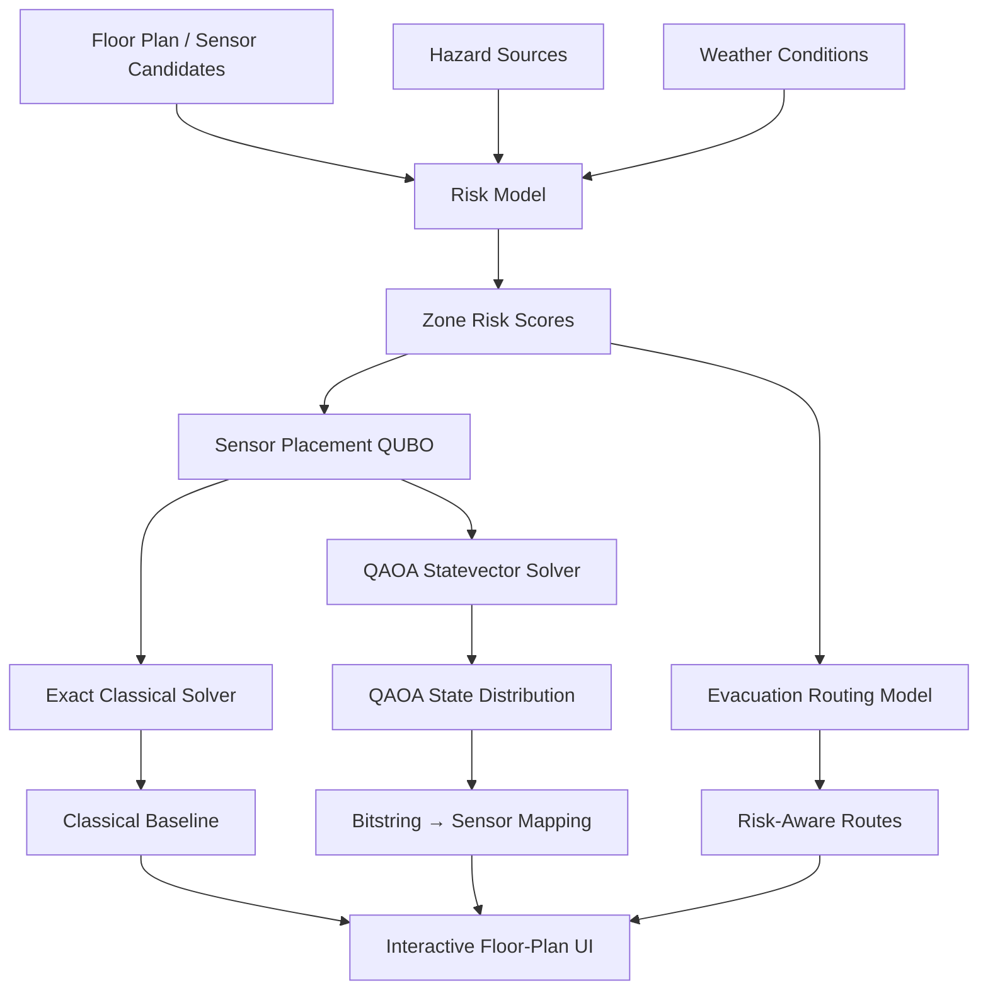

# Quantum SafeON

### Risk-Aware Sensor Placement & Evacuation Optimization with QUBO / QAOA

Quantum SafeON is an optimization prototype that connects **hazard-aware sensor placement**, **evacuation routing**, **classical optimization baselines**, and **QAOA-based combinatorial optimization** in a single interactive workflow.

The system models how hazards, weather conditions, sensor coverage, evacuation routes, and corridor congestion interact — and provides an interactive floor-plan interface for exploring optimization results.

> **Core idea:** sensors determine what parts of a site can be reliably observed, while evacuation decisions depend on the resulting risk landscape.

---

## My Role & Contributions

Quantum SafeON was originally developed collaboratively as a team project for the **Quantum Reframing Challenge 2026**.

### Original Team Project

I contributed collaboratively to:

- problem framing for hazard-aware sensor placement and evacuation optimization
- translating safety requirements into optimization objectives and constraints
- QUBO/QAOA methodology and experimental design
- hazard, weather, sensor-coverage, and evacuation scenario modeling
- interpretation of classical and quantum optimization results
- system-level reasoning connecting sensor placement with evacuation planning
- technical documentation and presentation of the end-to-end optimization workflow

### Independent Extensions

After the original team project, I independently extended the prototype as a portfolio-focused software project.

My extensions include:

- implemented extraction and ranking of the most probable **QAOA computational-basis states**
- built an interactive **QAOA State Distribution** visualization
- mapped QAOA bitstrings directly to physical sensor candidates on the floor plan
- implemented hover-based **state-to-sensor highlighting**
- refactored the interactive demo into an English-language interface
- improved human-readable explanations for hazard, weather, sensor, and evacuation results
- clarified modeling assumptions and limitations throughout the UI
- reorganized the project toward reproducible experimentation and deployment

---

# 1. Problem

During a fire, gas leak, or smoke event, the **closest evacuation route is not always the safest route**.

Risk can depend on:

- hazard location and intensity
- smoke or gas dispersion
- wind direction and speed
- unavailable exits
- corridor congestion
- sensor coverage
- worker location

At the same time, emergency decisions depend on the quality of available observations.

This creates two connected optimization problems:

1. **Where should a limited number of sensors be installed?**
2. **Which evacuation routes should be selected under changing risk conditions?**

Quantum SafeON formulates these as binary combinatorial optimization problems that can be evaluated using both classical methods and QAOA.

---

# 2. System Architecture



The current public demo uses a **CubiCasa5K residential floor plan** as an interactive visualization example. It is not presented as a real semiconductor or construction-site floor plan.

---

# 3. Mathematical Formulation

## 3.1 Binary Sensor Decisions

For each candidate sensor location \(i\):

```math
x_i \in \{0,1\}
```

where

- \(x_i = 1\): install a sensor at candidate \(i\)
- \(x_i = 0\): do not install a sensor

For \(N\) candidates, a solution is represented as a binary vector:

```math
x = (x_1, x_2, \dots, x_N)
```

For example:

```text
110100101010
```

represents one sensor-placement state over 12 candidate locations.

---

## 3.2 Sensor-Budget Constraint

If exactly \(K\) sensors should be installed, the constraint can be encoded as a quadratic penalty:

```math
P_K(x)
=
\left(
\sum_{i=1}^{N} x_i - K
\right)^2
```

This penalty is minimized when exactly \(K\) sensor candidates are selected.

---

## 3.3 Coverage Representation

Let:

- \(r_z\) = modeled risk weight of zone \(z\)
- \(a_{zi} \in [0,1]\) = fractional coverage of zone \(z\) by sensor candidate \(i\)

The interactive optimization uses a quadratic surrogate for coverage so that the objective remains a QUBO.

---

## 3.4 Interactive Demo QUBO

The current web demo uses the following objective:

```math
H_{\mathrm{demo}}(x)
=
-\sum_z r_z \sum_i a_{zi}x_i
+
\rho
\sum_z r_z
\sum_{i<j}
a_{zi}a_{zj}x_ix_j
+
\lambda_K
\left(
\sum_i x_i-K
\right)^2
```

with current defaults:

```math
\rho = 0.35,
\qquad
\lambda_K = 2.0
```

The three terms have distinct roles:

1. **Coverage reward**

```math
-\sum_z r_z \sum_i a_{zi}x_i
```

rewards sensors that cover higher-risk zones.

2. **Redundant-coverage penalty**

```math
\rho
\sum_z r_z
\sum_{i<j}
a_{zi}a_{zj}x_ix_j
```

penalizes pairs of sensors whose coverage overlaps strongly in the same risk-weighted zones.

3. **Sensor-budget penalty**

```math
\lambda_K
\left(
\sum_i x_i-K
\right)^2
```

encourages the solution to select exactly \(K\) sensors.

The interactive demo deliberately omits installation cost and some domain-specific constraints to keep the live optimization lightweight and interpretable.

---

## 3.5 Full Experimental QUBO

The original experimental pipeline uses a richer formulation.

Conceptually:

```math
H_{\mathrm{full}}(x)
=
H_{\mathrm{coverage}}
+
H_{\mathrm{cost}}
+
H_K
+
H_{\mathrm{required}}
```

### Risk-weighted coverage and overlap

```math
H_{\mathrm{coverage}}
=
-\sum_z r_z\sum_i a_{zi}x_i
+
\sum_z r_z
\sum_{i<j}
a_{zi}a_{zj}x_ix_j
```

The first term rewards coverage, while the quadratic term discourages redundant placement.

### Installation cost

Candidate installation cost is normalized by the maximum candidate cost:

```math
H_{\mathrm{cost}}
=
w_{\mathrm{cost}}
\sum_i
\frac{c_i}{c_{\max}}
x_i
```

with the experimental default:

```math
w_{\mathrm{cost}} = 0.35
```

### Sensor-count constraint

```math
H_K
=
\lambda_K
\left(
\sum_i x_i-K
\right)^2
```

If \(\lambda_K\) is not explicitly provided, the implementation scales it from the largest absolute linear QUBO coefficient.

### Required-zone coverage

For zones designated as required-coverage zones, the implementation adds an additional penalty.

For one valid covering sensor:

```math
H_z
=
\lambda_H(1-x_i)
```

For two valid covering sensors:

```math
H_z
=
\lambda_H(1-x_i)(1-x_j)
```

For three or more valid candidates, the full product would introduce higher-order terms. Because the solver pipeline expects a QUBO, the implementation uses a **quadratic truncation** rather than representing the higher-order polynomial exactly.

This approximation is explicitly recorded by the experimental pipeline instead of being treated as an exact hard constraint.

---

## 3.6 QUBO Surrogate vs. Evaluation Metric

The quadratic objective is used for optimization, but the selected configuration is evaluated using a nonlinear union-coverage metric.

For each zone:

```math
c_z(x)
=
1-
\prod_i
\left(
1-a_{zi}x_i
\right)
```

The overall risk-weighted coverage is then:

```math
C_{\mathrm{true}}(x)
=
\frac{
\sum_z r_z c_z(x)
}{
\sum_z r_z
}
```

This distinction is important:

> The QUBO uses a quadratic surrogate that can be optimized by QAOA and classical QUBO solvers, while the resulting sensor configuration is evaluated afterward using the nonlinear union-coverage metric.

This allows optimization to remain quadratic without pretending that overlapping sensor coverage is exactly linear.

---

# 4. QUBO → Ising → QAOA

A QUBO problem can be mapped to an Ising Hamiltonian using the binary-to-spin relation:

```math
x_i = \frac{1-z_i}{2}
```

The resulting cost Hamiltonian can be written in the form:

```math
H_C
=
\sum_i h_i Z_i
+
\sum_{i<j} J_{ij} Z_i Z_j
```

QAOA prepares a parameterized quantum state:

```math
|\psi(\boldsymbol{\gamma},\boldsymbol{\beta})\rangle
=
\prod_{l=1}^{p}
e^{-i\beta_l H_M}
e^{-i\gamma_l H_C}
|+\rangle^{\otimes N}
```

where \(H_M\) is the mixer Hamiltonian.

The final state can be expressed as:

```math
|\psi\rangle
=
\sum_x \alpha_x |x\rangle
```

and each computational-basis state has probability

```math
P(x) = |\alpha_x|^2
```

---

# 5. QAOA State Distribution

One of my independent extensions was making the QAOA result **interpretable inside the application**.

Instead of displaying only a final objective value, the system extracts the most probable computational-basis states from the optimized statevector.

For each state, the UI displays:

- rank
- bitstring
- probability
- selected sensors
- QUBO energy

Example:

```text
Bitstring
110100101010

Selected Sensors
S1, S2, S4, S7, S9, S11
```

When the user hovers over a QAOA state, the corresponding sensor candidates are highlighted directly on the floor plan.

This creates an explicit mapping:

```text
QAOA Statevector
       ↓
Probability P(x)
       ↓
Binary State
110100101010
       ↓
Selected Sensors
S1 S2 S4 S7 S9 S11
       ↓
Interactive Floor Plan
```

This visualization is intended to make the relationship between **quantum state probabilities and actual optimization decisions** easier to inspect.

---

# 6. Classical Baselines vs. QAOA

The original experiments compared QAOA against classical optimization methods including:

- Exact enumeration
- Greedy search
- Simulated Annealing
- Random baseline

For the 12-variable sensor-placement problem with \(K=6\):

| Detection Radius | Exact Weighted Coverage | QAOA p=1 | QAOA p=2 |
|---|---:|:---:|:---:|
| Low | 0.197 | Optimal state found | Optimal state found |
| Nominal | 0.510 | Optimal state found | Optimal state found |
| High | 0.682 | Not found | Optimal state found |

The p=1 failure in the high-radius case is intentionally retained rather than hidden.

This project **does not claim quantum advantage**.

For the current small problem size, exact classical optimization remains computationally feasible and serves as the reference baseline.

---

# 7. Evacuation Optimization & Congestion

Evacuation routing uses a risk-aware objective rather than distance alone.

A simplified route cost is:

```math
C_{\text{route}}
=
\sum_e
d_e
\left(
1 + \lambda_r r_e
\right)
+
C_{\text{congestion}}
```

where:

- \(d_e\) = segment distance
- \(r_e\) = modeled risk along the segment
- \(C_{\text{congestion}}\) = penalty for shared evacuation corridors

This means the system can prefer a slightly longer path when it reduces modeled hazard exposure.

---

## Congestion Crossover Experiment

The original evacuation experiment evaluated when independently selecting each worker group's shortest route stops being globally optimal.

| Total Occupancy | Independent Shortest Routes Globally Optimal? | Reported Makespan Change |
|---:|:---:|---:|
| 24 | Yes | No difference |
| 60 | Yes | No difference |
| 120 | Yes | No difference |
| 200 | Yes | No difference |
| **320** | **No** | **384.2 s → 312.9 s** |
| 480 | No | 384.2 s → 369.7 s |

At higher occupancy, shared-corridor congestion couples decisions between worker groups.

This is important because the optimization can no longer be decomposed into independent shortest-path decisions.

It motivates a **joint combinatorial optimization formulation**, without implying that quantum optimization is required or superior.

---

# 8. Hazard & Weather Modeling

The interactive prototype supports multiple configurable hazard sources:

- Fire
- Gas Leak
- Smoke

Each hazard contains:

- position
- impact radius
- intensity
- hazard-type weighting

Outside the configured impact radius, the current demo uses a first-order distance-decay approximation.

When weather observations are available, wind direction and speed can modify modeled downwind risk.

The current approximation is **not CFD** and does not model:

- wall shielding
- HVAC
- ceiling height
- local turbulence
- detailed gas physics

These limitations are explicitly surfaced in the UI.

---

## Weather Sensitivity Experiment

The original project evaluated:

- 8 wind directions
- 4 wind-speed levels

for a total of 32 hypothetical weather scenarios.

Reported results showed:

- **30 / 32** scenarios retained the same optimal sensor placement as the no-wind baseline
- the two changed configurations differed by one sensor
- placement changes occurred only under the tested **10 m/s strong-wind scenarios**
- the configured hard coverage threshold remained satisfied across all 32 scenarios

These 32 cases are sensitivity scenarios, not 32 independent weather observations.

---

# 9. Interactive Demo

Run the local application:

```bash
python src/ui/server.py
```

Then open:

```text
http://localhost:8788
```

The demo includes:

- interactive floor-plan visualization
- configurable detection radius
- sensor-candidate placement
- multiple hazard sources
- weather adjustment
- exits and worker locations
- risk heatmap
- risk-aware evacuation routes
- congestion analysis
- Exact classical optimization
- ideal-statevector QAOA
- optional IonQ Cloud Simulator integration
- QAOA State Distribution
- interactive state-to-sensor highlighting
- layer filtering and route inspection

The demo does **not** execute on a physical QPU.

---

# 10. Quantum Backends

### Local

The default QAOA backend is an ideal local statevector simulator.

### IonQ

The project contains integration for the IonQ cloud environment and has been tested with the IonQ simulator workflow.

Physical `ionq_qpu` execution is **not claimed** in this repository.

---

# 11. Run the Experiments

Create an environment:

```bash
python -m venv .venv
source .venv/bin/activate
pip install -r requirements.txt
```

### Sensor-placement experiment

```bash
python src/run_experiment.py
```

### Evacuation experiment

```bash
python src/run_evacuation_experiment.py
```

### Weather sensitivity experiment

```bash
python src/weather_sensitivity.py
```

### Interactive demo

```bash
python src/ui/server.py
```

Optional API-backed functionality uses environment variables rather than committed credentials.

---

# 12. Repository Structure

```text
Quantum_SafeON/
│
├── src/
│   ├── qaoa_sim.py
│   ├── hazard_explain.py
│   ├── fire_scenario.py
│   ├── weather_kma.py
│   ├── weather_sensitivity.py
│   ├── run_experiment.py
│   ├── run_evacuation_experiment.py
│   │
│   └── ui/
│       ├── server.py
│       └── index.html
│
├── config/
├── Data/
├── results/
├── tests/
└── README.md
```

---

# 13. Modeling Assumptions & Limitations

Quantum SafeON is a research and portfolio prototype, not a production emergency-management system.

Important limitations include:

- the public demo floor plan is not a real industrial-site floor plan
- current hazard propagation is a simplified first-order approximation
- wall geometry and physical obstruction are not fully modeled
- evacuation routing uses a simplified grid representation
- congestion uses a first-order corridor-capacity approximation
- no quantum advantage is claimed
- no physical QPU execution is claimed
- current problem sizes remain tractable using classical exact methods
- the floor-plan-to-zone ML module discussed during the original project was not implemented and is not represented as a completed feature

---

# 14. Project Provenance

Quantum SafeON originated as a collaborative team project for the **Quantum Reframing Challenge 2026**.

This repository is maintained as my fork of the original team repository in order to preserve project history and attribution.

The original optimization concept, experimental framework, and system design were developed collaboratively by the team.

My post-competition work is maintained as clearly identifiable independent extensions, including the interactive QAOA state-analysis and visualization work described above.

---

# 15. Current Development

Current portfolio-development priorities:

- cloud deployment of the interactive demo
- improved reproducibility and automated testing
- architecture and demo visualization
- additional classical-vs-QAOA analysis

Potential future research directions include richer industrial floor-plan modeling and learned risk estimation, but these are not presented as currently implemented features.

---

## Tech Stack

- **Languages:** Python, JavaScript, HTML/CSS
- **Optimization:** QUBO, Exact Search, Greedy, Simulated Annealing, QAOA
- **Quantum:** Qiskit, IonQ integration
- **Scientific Computing:** NumPy
- **Backend:** Python HTTP server
- **Visualization:** HTML Canvas
- **Data / Modeling:** Hazard scenarios, weather observations, evacuation graphs

---

## Status

**Portfolio extension in active development.**

Current interactive implementation:

- QUBO sensor optimization ✅
- Exact classical baseline ✅
- QAOA ideal-statevector simulation ✅
- QAOA state-distribution visualization ✅
- Interactive state-to-sensor mapping ✅
- Hazard / weather / evacuation visualization ✅
- English portfolio UI ✅
- Physical QPU benchmark ❌
- Cloud deployment → next
